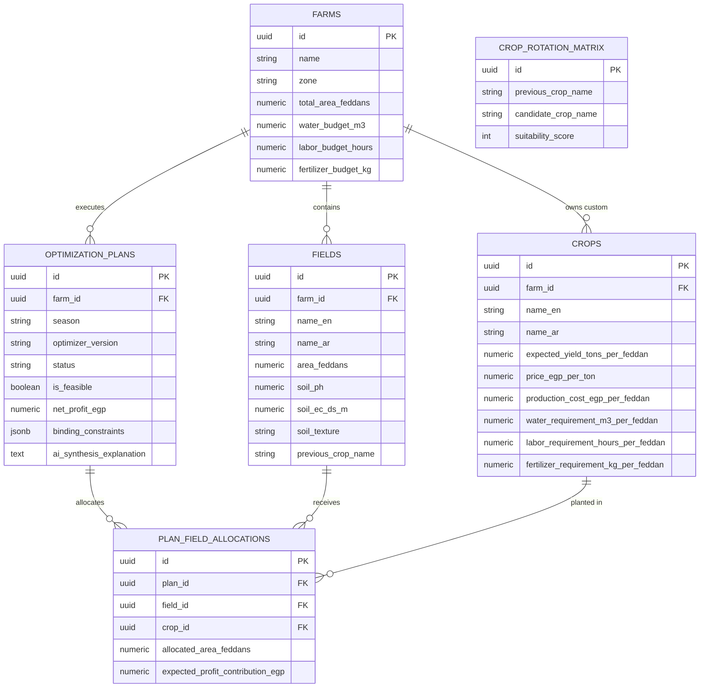
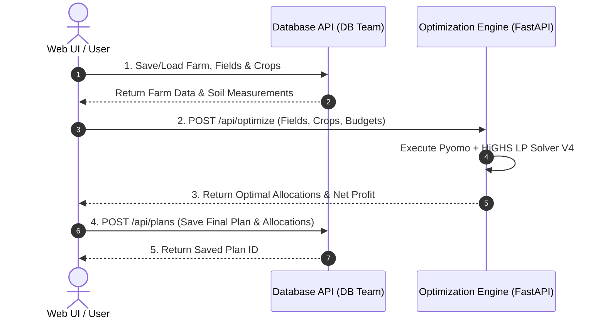

# 🗄️ Database & API Integration Guide

This document defines the relational database architecture and API communication contract for the **Crop Mix Business Planner**.

---

## 1. Relational Database Schema (`docs/schema.sql`)

The database is designed for PostgreSQL / MySQL / SQL Server and comprises 6 relational tables:

---

## 2. Table Summary

| Table | Description | Primary Key | Foreign Keys |
|---|---|---|---|
| **`farms`** | Stores farm metadata, Egyptian regional zone, and global seasonal resource budgets. | `id` (UUID) | None |
| **`fields`** | Land parcel boundaries, soil chemistry (pH, EC salinity, texture), and crop history. | `id` (UUID) | `farm_id` $\to$ `farms(id)` |
| **`crops`** | Financial benchmarks, water/labor/fertilizer requirements, and soil tolerance bounds. | `id` (UUID) | `farm_id` $\to$ `farms(id)` (NULL for global catalog) |
| **`crop_rotation_matrix`** | Source of truth rotation suitability scores (0 or 1) between previous & next crop. | `id` (UUID) | None |
| **`optimization_plans`** | Historical record of executed optimization runs, status, financials, and AI notes. | `id` (UUID) | `farm_id` $\to$ `farms(id)` |
| **`plan_field_allocations`** | Exact feddan allocations of crops to fields for a saved optimization plan. | `id` (UUID) | `plan_id` $\to$ `optimization_plans(id)`, `field_id`, `crop_id` |

---

## 3. Postman Collection (`docs/postman_collection.json`)

The accompanying Postman Collection (`docs/postman_collection.json`) provides ready-to-import requests for:

1. **Farm Management & Budgets**
   - `POST /api/farms` — Create farm & set resource budgets
   - `GET /api/farms/:farm_id` — Fetch farm profile & registered fields
2. **Fields & Soil Measurements**
   - `POST /api/farms/:farm_id/fields` — Add land parcel & soil chemistry
   - `GET /api/farms/:farm_id/fields` — List all farm fields
3. **Crop Catalog & Rotation Matrix**
   - `GET /api/ecocrop/crops` — Fetch EcoCrop catalog
   - `GET /api/rotation/matrix` — Fetch rotation suitability rules
4. **Optimization Engine & Plan Storage**
   - `POST /api/optimize` — Run Pyomo + HiGHS V4 Optimizer
   - `POST /api/plans` — Save optimization plan & allocations to DB
   - `GET /api/plans/:plan_id` — Retrieve historical plan

---

## 4. How the Teams Interact

